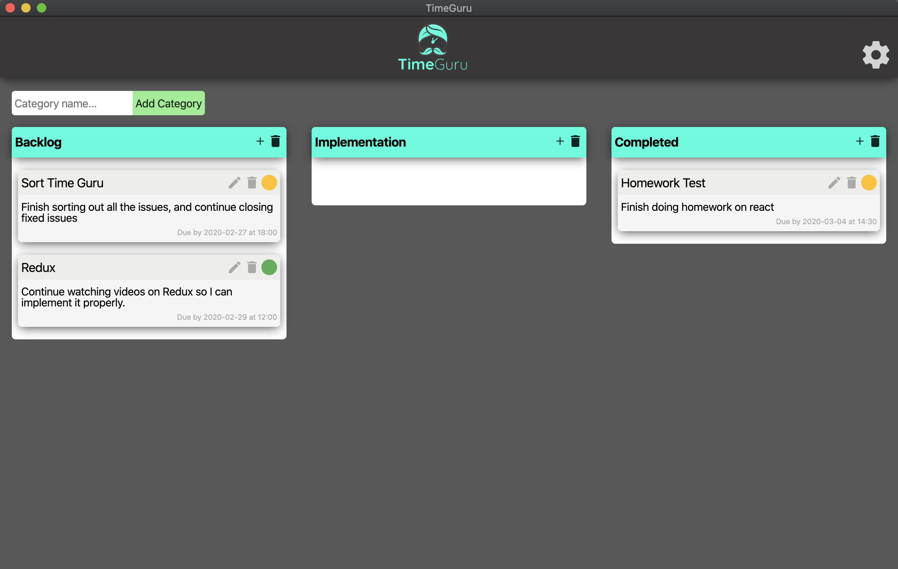

# TimeGuru
Welcome to the TimeGuru task management system built for both Mac & Windows. Become the most efficient version of yourself by keeping track of what needs to be done, and by when! Have bad internet or travel a lot? TimeGuru is stored locally so you can access it from anywhere! Get on your way to efficiency!

## Motivation
Multiple times I have used other task management systems, and I always run into the problem of losing all of my data once I have no internet connection. Whether that be traveling or internet loss TimeGuru data is stored locally so you never have to worry about losing your task info.

## Screenshots


## Installation
```bash
git clone https://github.com/chasehoff/Desktop-Kanban.git
```
